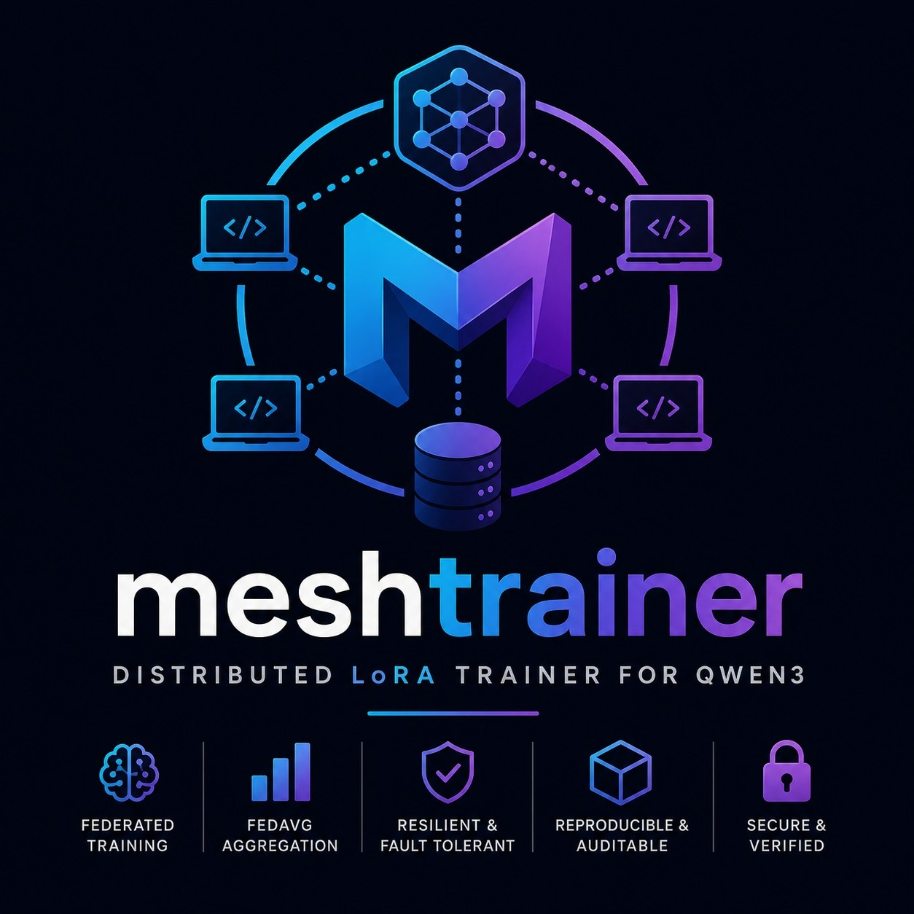

# MeshTrainer



**Open, local-first distributed LoRA training for language models.**

[](LICENSE)

[](https://github.com/spicouc/meshtrainer)

MeshTrainer is evolving from a Qwen-only distributed training prototype into a **model-agnostic training application** designed to make distributed fine-tuning accessible on ordinary local hardware.

> **Development status — 2026-08-17:** the certified distributed core, Qwen3 backend, MiniCPM5 backend and Product MVP application layer are closed. The next active milestone is the browser Web UI.

## Current certified status

| Component | Status |
|---|---|
| Generic distributed core | **CLOSED** |
| Qwen3 backend | **CERTIFIED** |
| MiniCPM5 backend | **CERTIFIED** |
| Real two-worker overlap | **CERTIFIED** |
| Multi-model portability | **PROVEN** |
| Product MVP Phase 0 — design | **CLOSED** |
| Product MVP Phase 1 — application layer/API/CLI | **CLOSED** |
| Real Qwen training through the application layer | **PASS** |
| Product MVP Phase 2 — Web UI | **AUTHORIZED / NEXT** |

See [`PROJECT_STATUS.md`](PROJECT_STATUS.md) for the milestone and certification details.

## Architecture

```text
Browser / Web UI             CLI
        |                      |
        +----------+-----------+
                   |
                   v
          FastAPI REST + SSE
                   |
                   v
          MeshTrainerService
                   |
                   v
               JobRunner
                   |
                   v
      Certified distributed core
          |                 |
          v                 v
     Qwen3 backend     MiniCPM5 backend
          |                 |
          +--------+--------+
                   |
                   v
             Workers A / B
                   |
                   v
       contributions + FedAvg
                   |
                   v
           final LoRA adapter
```

The application layer is additive: the certified distributed core remains isolated from the UI. Test/certification drivers are not used as the product API.

## What the current application layer supports

- backend discovery through the backend registry;
- Qwen3 and MiniCPM5 model backends;
- JSONL dataset registration, upload and validation;
- training-job creation and validation;
- LoRA configuration;
- worker and concurrency configuration;
- safe job start/cancellation lifecycle;
- persistent job state in a separate application SQLite database;
- runner reconciliation after application restart;
- live events through SSE;
- metrics and per-job logs;
- artifact metadata, SHA-256 verification and download contract;
- FastAPI management API;
- scriptable CLI;
- Dummy backend hidden in production mode.

A real Qwen3 end-to-end training run has passed through the new application layer, including independent worker contributions, validation/activation, FedAvg and final adapter generation.

## Backends

The architecture is based on a `TrainingBackend` contract rather than model-specific orchestration:

```text
MeshTrainer Core
    |
    +-- Qwen3
    +-- MiniCPM5
    +-- future compatible backends
```

Qwen3 and MiniCPM5 are the first two certified real backends. Supporting another model family requires a conforming backend implementation; the distributed core should not need model-specific changes.

## Current roadmap

### Completed

- robust coordinator / worker protocol;
- lease, revision and authority boundaries;
- weighted FedAvg;
- safe crash recovery and exactly-once behavior;
- real Qwen3 backend;
- real MiniCPM5 backend;
- multi-model portability proof;
- product architecture design;
- application service layer;
- FastAPI API skeleton;
- CLI skeleton;
- dataset layer;
- persistent job lifecycle;
- SSE event layer;
- real-Qwen application E2E.

### Next — Product MVP Phase 2

Build the first usable browser interface:

```text
Dashboard
  -> New Training Job
  -> Qwen3 / MiniCPM5
  -> Dataset
  -> LoRA configuration
  -> Workers / concurrency
  -> Validate
  -> Start
  -> Live workers / rounds / loss / ETT / logs
  -> Completed
  -> Download adapter
```

### Then — Product MVP Phase 3

- hardening;
- UX polish;
- installation / launch flow;
- final documentation;
- final MVP packaging.

## Project principles

- **Open and local-first.** Ordinary users should be able to run and understand the system without depending on a proprietary training service.
- **Core stability.** Product features are layered on top of the certified distributed core rather than silently changing its semantics.
- **Model agnostic.** Orchestration belongs to MeshTrainer; model-specific behavior belongs to backends.
- **Evidence over claims.** Milestones are closed with reproducible gates, clean extraction checks and artifact hashes.
- **No model weights in the repository.** Model snapshots, checkpoints and generated adapters remain external artifacts.

## Public repository synchronization

The GitHub repository originally published the earlier v1.0/Qwen-focused snapshot. The project has since advanced through the certified multi-model and Product MVP milestones listed above. **This README and the status document describe the current authoritative development state; synchronization of the newer certified source snapshot to the public repository is being handled separately from the large training artifacts.**

Model weights, checkpoints, generated adapters, local databases, secrets and environment-specific evidence must not be committed.

## License

MIT
